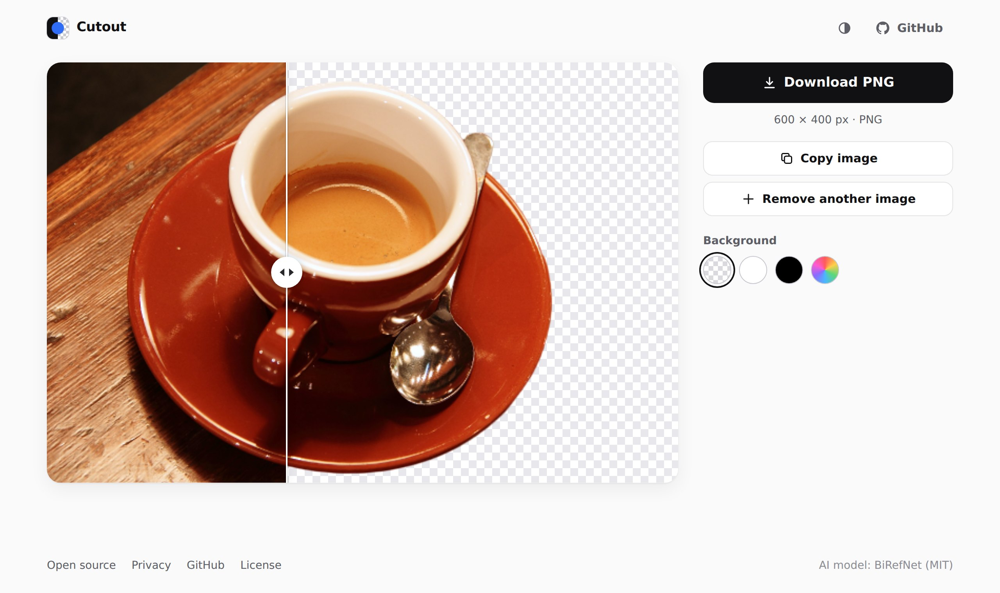
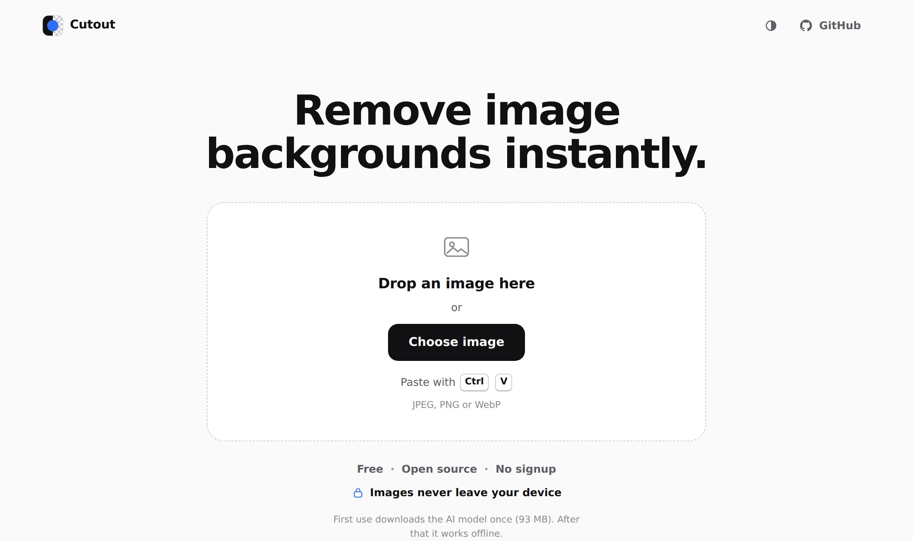

# Cutout — remove image backgrounds in your browser

> **Working title.** The product name is a placeholder and can be changed in
> [`src/config.ts`](src/config.ts) and [`public/manifest.webmanifest`](public/manifest.webmanifest).

Drop, paste or choose an image — the background is removed automatically and
you download a transparent PNG. **Free, open source, no signup, and your images
never leave your device**: the AI model runs locally in your browser.



<details>
<summary>Start page</summary>



</details>

## Features

- **Three ways in:** drag & drop anywhere on the page, *Choose image*, or
  **Cmd+V / Ctrl+V** to paste a screenshot or copied image — processing starts
  immediately, no extra clicks.
- **Instant preview:** your image appears at once; the result wipes in over it
  when ready.
- **Soft, real alpha edges** (no hard threshold), bicubic matte upscaling and
  colour decontamination for clean hair and fur edges.
- **Original resolution:** the PNG has the size of your photo (very large images
  are reduced only when the device would run out of memory, and the app says so).
- **Download PNG**, **copy to clipboard**, before/after slider, background
  preview (transparent, white, black, custom colour) and *Download with
  background*.
- **WebGPU** acceleration with automatic **WebAssembly** fallback.
- **Works offline** once the app and model are cached; installable as a PWA.
- Real download progress for the one-time model download (≈ 93 MB), cached
  afterwards.
- English and German UI, light/dark theme, keyboard and screen-reader friendly,
  responsive with iPhone safe areas.

## Privacy

- Images are processed **only in your browser** (Web Worker + ONNX Runtime Web).
- **No uploads**, no server-side processing, no accounts, no cookies, no
  analytics, no third-party scripts or fonts.
- The Content-Security-Policy only allows network requests to the site's own
  origin (`connect-src 'self'`).
- Images and results live in memory only and are gone on reload. The PNG
  contains no metadata (no EXIF, no location).
- The same policy also binds the background worker that processes the image
  (it is started in a way that inherits the page's policy).
- End-to-end tests record every network request while an image is processed
  (they fail if anything other than a `GET` for the app's own files is sent)
  and check that the worker is blocked from contacting other servers.

See also the in-app [privacy page](privacy.html).

## How it works

```
image ─► Web Worker: decode (EXIF-aware) ─► 1024×1024 model input
      ─► BiRefNet_lite (ONNX Runtime Web, WebGPU or WebAssembly)
      ─► matte upscaled to original size ─► colour decontamination ─► PNG
```

Details: [docs/ARCHITECTURE.md](docs/ARCHITECTURE.md).

## AI model

| | |
| --- | --- |
| Model | **BiRefNet_lite** (general use, Swin-T backbone, epoch 232) by Peng Zheng et al. |
| Source | Official release: <https://github.com/ZhengPeng7/BiRefNet/releases/tag/v1>, file `BiRefNet-general-bb_swin_v1_tiny-epoch_232.onnx`, SHA-256 `5600024376f5…3333` |
| Licence | **MIT** (code and weights) |
| In the browser | 92.5 MB (float16 weights), 4 chunks with SHA-256 verification |

The official ONNX file needs ~12 GB of RAM because of how its deformable
convolutions were exported; [`tools/model/convert_birefnet.py`](tools/model/convert_birefnet.py)
rewrites them into a mathematically equivalent, memory-lean form (≈ 1.8 GB,
max. deviation 4 × 10⁻⁵) and makes the graph WebGPU-compatible. The research,
licence comparison (IMG.LY is AGPL-3.0, BRIA RMBG is non-commercial) and all
measurements are in [docs/MODEL.md](docs/MODEL.md); quality notes in
[docs/QUALITY.md](docs/QUALITY.md).

## Performance

Measured on the development machine (4 vCPU cloud VM, **no GPU**, headless
Chromium, WebAssembly with 3 threads):

| | |
| --- | --- |
| Initial page (HTML + CSS + JS, gzip) | ≈ 22 KB — the AI runtime and model load only when needed |
| ONNX Runtime (first use, gzip) | 3.7 MB (WebAssembly build) or 6.7 MB (WebGPU build) |
| Model download (first use only) | 92.5 MB |
| Model ready: first visit / cached | 9.1 s (local network) / 3.9 s |
| Inference, 1024 × 1024 | ≈ 22 s on CPU (WebAssembly); a GPU via WebGPU is much faster |
| Decode / refine / PNG, 12 MP photo | 0.6 s / 1.4 s / 1.9 s |
| Decode / refine / PNG, 24 MP photo | 1.3 s / 2.1 s / 3.2 s |
| Peak memory of the page (CPU path, 12 MP) | ≈ 2.7 GB, stable over repeated images |

WebGPU could not be timed on real hardware in this environment (only a
software GPU was available); it was verified functionally.

## Browser support

Requirements: WebAssembly SIMD, module Web Workers, `OffscreenCanvas` and
`createImageBitmap` — current Chrome, Edge, Firefox and Safari (16.4+), iOS
Safari 16.4+ and Chrome for Android. WebGPU is used where available (Chrome/Edge
113+, Safari 26, Firefox on Windows) and falls back to WebAssembly otherwise or
on any WebGPU error. Unsupported browsers get a clear message.

**Tested:** Chromium, with 28 automated end-to-end tests: file picker, drag &
drop, paste, copy to clipboard, downloads, EXIF orientation, error cases,
privacy (network audit, CSP in the worker), WebAssembly path, WebGPU path (via
SwiftShader), WebGPU→WebAssembly fallback, model cache, offline mode and the
real model. **Not yet tested
on real devices:** Firefox, Safari, iOS and Android — please report issues.

## Local development

```bash
npm install
python3 -m pip install -r tools/model/requirements.txt
npm run model      # download official model (224 MB), verify, convert → public/models/
npm run dev        # http://localhost:5173
```

Other commands:

```bash
npm run typecheck
npm run lint
npm test                      # unit tests
npm run build                 # production build in dist/
npx vite preview              # serve dist/ on http://localhost:4173
npx playwright test           # end-to-end tests (needs a build)
RUN_REAL_MODEL=1 npx playwright test tests/e2e/real-model.spec.ts
npm run quality -- <folder>   # HTML quality report for your own images (needs preview running)
```

## Deployment (GitHub Pages)

The workflow [`.github/workflows/ci.yml`](.github/workflows/ci.yml) runs on every
push to `main`: install → typecheck → lint → unit tests → build the model
(download, SHA-256 check, conversion, byte-identical to the validated model) →
production build → end-to-end tests including the real model → deploy to GitHub
Pages. No secrets are needed.

One-time setup: **Settings → Pages → Build and deployment → Source: GitHub
Actions**. The site is then available at
`https://cutout.t1mo.dev/`
(or `https://<user>.github.io/Cutout/` without a custom domain).

The build uses relative paths, so the same files also work on a custom domain
(add it under Settings → Pages) or any other static host. The model is not
stored in git; it is built during deployment.

GitHub Pages has a soft limit of 100 GB traffic per month (≈ 1,000 first-time
model downloads). For more traffic, host the model on a CDN, set
`VITE_MODEL_BASE_URL` at build time and add that origin to `connect-src` in the
CSP (`index.html`).

## Project structure

```
src/app/        UI: controller, state machine, view, input, compare slider
src/worker/     inference worker, ONNX Runtime session, image pipeline
src/shared/     pure logic: protocol, file checks, resampling, PNG, model loader
src/sw/         service worker
src/i18n/       English and German texts
tools/model/    model conversion (Python)
tools/quality/  quality report tool
tests/e2e/      Playwright tests; unit tests live next to the code (*.test.ts)
docs/           architecture, model and quality documentation
```

## Known limitations

- The first use downloads ≈ 93 MB. Without WebGPU, one image takes roughly
  10–60 s depending on the CPU.
- Processing needs a lot of memory (≈ 2–3 GB on the CPU path). Older phones
  may fail with "Not enough memory"; images are downscaled on phones when
  necessary (e.g. max. 16.7 MP on iOS).
- The model works at 1024 × 1024: very fine hair strands on large photos get
  soft, true transparency (glass, motion blur) is not modelled. See
  [docs/QUALITY.md](docs/QUALITY.md).
- A running inference cannot be interrupted; a newer image starts right after
  it and the old result is discarded.
- HEIC photos only open in browsers that can decode HEIC (Safari).
- Not yet tested on real Firefox/Safari/iOS/Android devices.

## Roadmap ideas

Optional high-quality mode (BiRefNet HR/matting on strong GPUs), fp16 compute
on WebGPU, freeing memory when idle, batch processing and ZIP download,
erase/restore brush, WebP export, share target.

## Contributing & licence

Contributions are welcome — see [CONTRIBUTING.md](CONTRIBUTING.md),
[CODE_OF_CONDUCT.md](CODE_OF_CONDUCT.md) and [SECURITY.md](SECURITY.md).

The project is released under the [MIT License](LICENSE). Third-party
components (BiRefNet model: MIT; ONNX Runtime Web: MIT) are listed in
[THIRD_PARTY_NOTICES.md](THIRD_PARTY_NOTICES.md).
